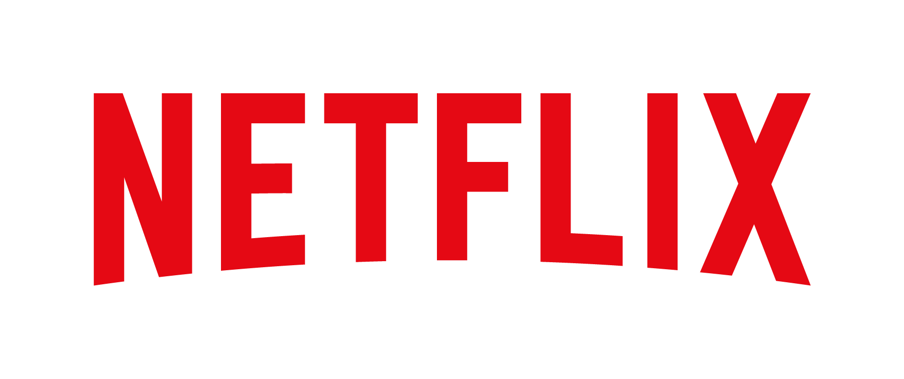

# Netflix Moviws and TV Shows Data Analysis using sql




## 📖 Overview

This project analyzes the Netflix Movies and TV Shows dataset using SQL. The objective is to solve real-world business problems and extract meaningful insights from the dataset using SQL queries.

---

## 🎯 Objectives

- Analyze the distribution of Movies and TV Shows.
- Identify the most common content ratings.
- Analyze content by release year, country, and duration.
- Find trends and patterns in Netflix's content library.
- Solve business questions using SQL.

---

## 🛠️ Tools Used

- PostgreSQL
- SQL
- Git & GitHub

---

## 📂 Dataset

The dataset used in this project is available on Kaggle.

**Dataset Link:**  
https://www.kaggle.com/datasets/shivamb/netflix-shows

---

## 🗂️ Database Schema

```sql
DROP TABLE IF EXISTS netflix;

CREATE TABLE netflix (
    show_id VARCHAR(5),
    type VARCHAR(10),
    title VARCHAR(250),
    director VARCHAR(550),
    casts VARCHAR(1000),
    country VARCHAR(550),
    date_added VARCHAR(55),
    release_year INT,
    rating VARCHAR(15),
    duration VARCHAR(15),
    listed_in VARCHAR(250),
    description VARCHAR(550)
);
```

---

## 📊 Business Problems Solved

1. Count the number of Movies vs TV Shows.
2. Find the most common rating for Movies and TV Shows.
3. List all Movies released in a specific year.
4. Find the top 5 countries with the most Netflix content.
5. Identify the longest Movie.
6. Find content added in the last five years.
7. Find all content directed by Rajiv Chilaka.
8. List TV Shows with more than 5 seasons.
9. Count content in each genre.
10. Categorize content based on keywords like "Kill" and "Violence".

---

## 📈 Key Insights

- Movies make up the majority of Netflix's catalog.
- TV-MA is the most common content rating.
- The United States contributes the highest amount of content.
- Netflix significantly expanded its content library after 2015.

---

## 📁 Project Structure

```
📦 netflix_sql_project
 ┣ 📄 netflix_sql_project.sql
 ┣ 📄 README.md
 ┣ 🖼️ Netflix_Logo_RGB.png
 ┗ 📄 netflix_titles.csv
```

---

## ⭐ Author

**Kanishka Singh**

If you found this project useful, don't forget to ⭐ this repository!
